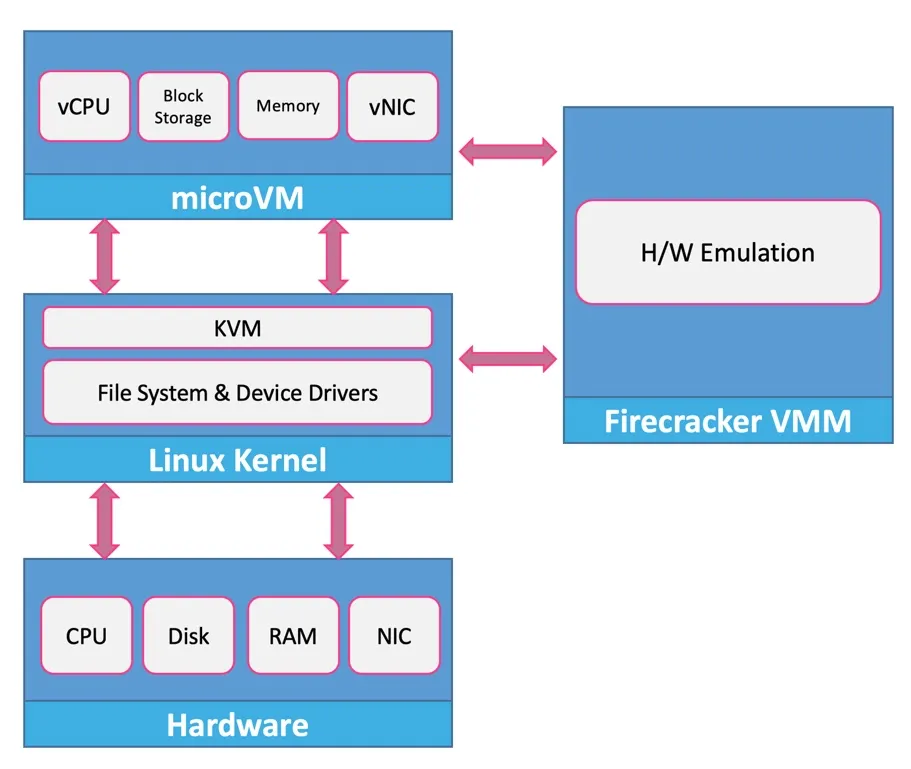

# Frirecracker
firecracker is a virtualization machine that runs on top of kvm.Firecracker is a great fit for serverless computing, where you need to run a lot of small, single-purpose, and short-lived microVMs.

## Key Features of Firecracker:

- Lightweight: Firecracker VMs have a memory overhead of less than 5 MiB per microVM.
- Fast Boot Time: MicroVMs can boot in less than 125 milliseconds.
- Security: Incorporates strong isolation mechanisms, using KVM (Kernel-based Virtual Machine) for secure virtualization.
- Minimalist: Designed to include only the necessary features, eliminating unnecessary components.

It's working structure:

## Firecracker Architecture
Firecracker’s architecture is streamlined to achieve its goals of minimalism and efficiency. Here’s a high-level overview of its components:

1. MicroVMs: These are the lightweight VMs that Firecracker manages. Each microVM runs a single application or a small set of closely related processes.
2. Jailer: This component ensures that each microVM is isolated and runs in a secure environment. It manages the namespaces, cgroups, and seccomp filters.
3. KVM: Firecracker leverages KVM for hardware virtualization, providing the underlying support for running microVMs.
4. API Server: Firecracker includes a simple REST API for managing the lifecycle of microVMs (creation, configuration, start, stop, etc.).

## Firecracker vs. Docker
While both Firecracker and Docker aim to provide efficient, scalable, and isolated environments for applications, they do so in fundamentally different ways.

1. Isolation:

Firecracker: Provides hardware-level isolation using KVM, which is more secure and robust against attacks that exploit the shared kernel.
Docker: Uses OS-level isolation with containers sharing the host’s kernel, making it lightweight but potentially less secure.

2. Performance Overhead:

Firecracker: MicroVMs have a slightly higher overhead compared to containers due to the virtualization layer but are still very lightweight.
Docker: Containers have minimal overhead as they share the host OS resources directly.

3. Boot Time:

Firecracker: MicroVMs can boot in less than 125 milliseconds, making them suitable for short-lived tasks.
Docker: Containers can start even faster than microVMs, almost instantaneously in many cases.

4. Use Cases:

Firecracker: Ideal for serverless computing, running multi-tenant workloads with strong isolation, and scenarios where security is paramount.
Docker: Best suited for microservices, continuous integration/deployment pipelines, and development environments where speed and resource efficiency are crucial.

5. Management:

Firecracker: Managed through a simple REST API, designed for integration with higher-level orchestration tools.
Docker: Managed using Docker CLI and API, with extensive support for orchestration tools like Kubernetes.

# Scanned Yara rules
Windows executables (PE files)
Ransomware keywords
Shell command injection
Crypto miners
Keyloggers (critical)
Credential theft patterns
Network activity indicators
Obfuscated JavaScript
Base64 payloads